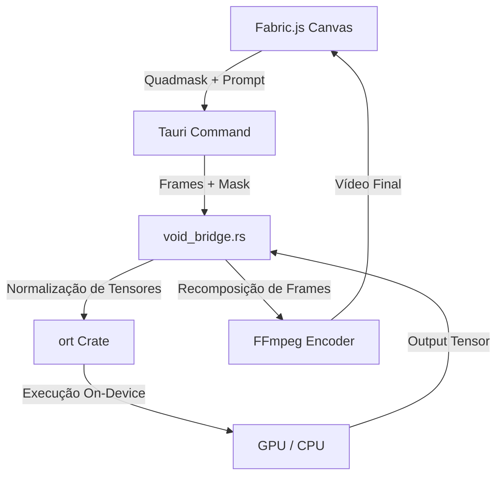

# VOID Engine: Detalhes Técnicos e Integração ONNX
Data: 2026-04-05
Status: Pesquisa / Conceitual

Este documento detalha a estratégia técnica para integrar o modelo **Netflix VOID** (Video Object and Interaction Deletion) no motor do Glyph, utilizando o ecossistema Rust e o runtime ONNX.

## 1. Por que ONNX Runtime (`ort`)?

A implementação original do VOID utiliza PyTorch e Diffusers (Python). Para um software desktop distribuível via Tauri, depender de um ambiente Python é problemático (tamanho do instalador, conflitos de versão, performance).

**Vantagens do ONNX no Glyph:**
- **Zero Python:** Inferência direta em C++/Rust.
- **Portabilidade:** Funciona em Windows/Linux com o mesmo binário de pesos.
- **Performance:** Otimizações específicas para hardware (TensorRT para NVIDIA, DirectML para Windows/AMD).
- **Segurança:** O carregamento de modelos via `ort` é mais isolado que a execução de scripts Python arbitrários.

## 2. Arquitetura da Bridge Rust/ONNX

## 3. Desafios de Implementação (Fase 9)

### 3.1. Quantização e VRAM
O modelo `void_pass1` tem ~5B parâmetros. Em FP16, ele consome cerca de 10GB-12GB de VRAM.
- **Alvo:** Converter para **INT8** ou **FP4** (via `bitsandbytes` ou `onnxruntime-genai`) para rodar em GPUs de 8GB.

### 3.2. Operadores 3D
O VOID utiliza **3D Causal VAE**. Precisamos garantir que o ONNX Runtime suporte todos os operadores de convolução 3D e atenuação espacial-temporal usados no CogVideoX. Caso contrário, será necessário implementar os kernels customizados em Rust/CUDA.

## 4. Próximos Passos (Claude Code)
1. Analisar os grafos do modelo `void_pass1.safetensors`.
2. Validar a compatibilidade da crate `ort` com os operadores do CogVideoX.
3. Criar um protótipo de "Hello World" de inpainting de frame único.
